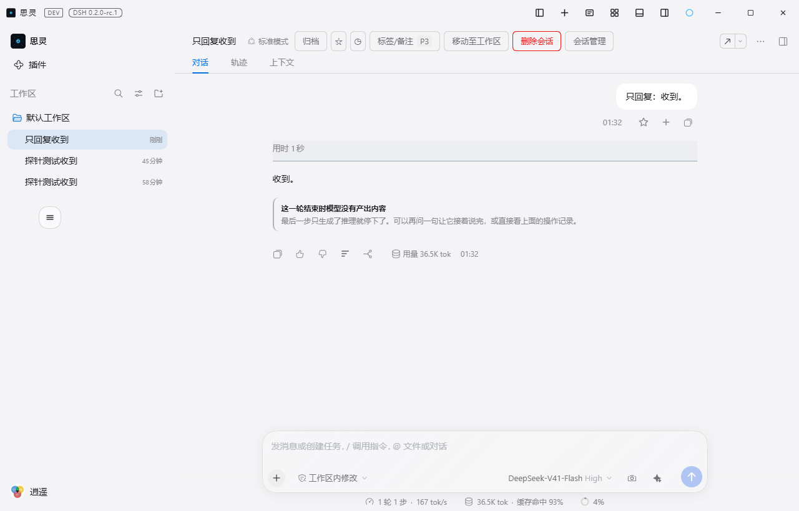

# @max-null/dsh-allostasis

本插件属于 **`@max-null/*` 插件系列**——这一系列共同构成 **[SSID（思灵 · Seek Soul in Darkness）](https://github.com/Max-Null/seek-soul-in-darkness)** 桌面体验。SSID 是整合它们的盒：`dsh-allostasis` · `dsh-capture` · `dsh-chat-rail` · `dsh-chinese-thinking` · `dsh-draft-polish` · `dsh-guardian` · `dsh-habit` · `dsh-memory` · `dsh-node-appearance` · `dsh-plugin-center` · `dsh-quick-toolbar` · `dsh-skill-mcp-center` · `dsh-ssid-panels` · `dsh-ssid-zh-ui` · `dsh-achievements`。

This plugin belongs to the **`@max-null/*` family** — a set of plugins that together form the **[SSID (思灵 · Seek Soul in Darkness)](https://github.com/Max-Null/seek-soul-in-darkness)** desktop experience.

Allostasis for the DeepSeek Harness — session self-regulation rather than monitoring.
Before each step it reads the most recent reasoning block and appends one near-end message
when that thinking has drifted into English (**Chinese anchoring**) or collapsed into
repetition (**degeneration reminder**). During generation it measures the same repetition
chunk by chunk and can **cut the step short** mid-stream, then steer one resume step
(**stream cut**). When a turn ends with no visible output at all (**silent turn**) — and it
was not this plugin itself that cut it — the browser half folds that verdict from the event
stream and shows a notice beneath the turn.

## 它做什么

**应变**（allostasis）取「**通过改变自己来维持自己**」之义——它不只是一个监测器，它会改变行为。

| 能力 | 状态 | 触发条件 |
|---|---|---|
| **中文锚定** | **已实现** | 上一步思考的英文功能词密度越线 |
| **推理退化提醒** | **已实现** | 上一步思考的重复率越线，且窗口内累计 N 步成立 |
| **流内掐断** | **已实现** | 生成过程中重复率越线，且命中行之后思考仍在继续（`streamCut`，**默认只观察**） |
| **空回合提示** | **已实现** | 回合收尾时末条助手消息没有非空文本（只在 `completed` 回合上判；被本插件掐断过的那一轮除外） |
| 上下文占用感知 | 计划中 | 需先定「什么情况下才出现」（持续在场会退化成背景音） |
| 压缩预约落盘 | 计划中 | 待通路验证：退化样本散布在整段退化区间，「只压一小段」能否打断循环尚无证据（二期方案 §八.1） |

**三期把责任面改了**：前两期只在本插件的判定里说话，三期能在**生成过程中把它停掉**。
这是本插件里唯一一个不需要模型同意的动作，所以默认关着（`streamCut` 缺省 `observe`，
只判定与留痕），开启方式与代价见下面「判据 · 流内判据」与设计文档
`docs/设计/2026-10-07-应变三期-生成中掐断与重定向.md` §六 / §七。

**除空回合提示外，本插件的动作都是「发一条消息」**：一期锚定与二期提醒追加在下一步之前，
三期的续跑追加在回合收尾处。它们共用 `notice` 形式的 source——在**轨迹页**是折叠态就显示
一行摘要的注入行，不弹窗、不打断；**对话页不显示**（2026-09-29 在 SSiD dev / DSH 0.2.0-rc.1
上实测，口径见二期方案 §九）。

**空回合提示是唯一有界面的一个**，就挂在那一段空白下面（见「截图」段）。它不发消息、不改模型输入——
浏览器半边从 `turn/start` / `assistant/message` / `turn/end` 自己折叠出判定，投影成 Turn 尾部的一行提示。

**判定结果不写会话日志。** 内核的事件词汇表在构建期生成，下游插件的自定义类型不在其中，而 `Session.append()` 没有 `ignorable` 标记通道；无标记的自定义事件会让**整份**日志在下次加载时被拒读。判定输入本来就可重放，留痕由 `console.debug` 诊断行与界面上那行提示承担。理由与取证见 `docs/设计/2026-09-30-空回合检测与可见化.md` §十一。掐断同样走这条路——它改的是流，不是日志。

**除空回合外全程静默，所以「确认它在工作」只能靠日志。** 前几种命中时只在轨迹页留一行（流内掐断那次则直接终止一次生成）；不命中时一个字都不说——「装了没有」「阈值生效没有」「这一步为什么没提醒」三个问题原本都无从回答，只能靠改配置去试。因此它在 `src/index.ts` 的 `apply` 里留三行痕：

```
[dsh-allostasis] loaded · driftThreshold=0.15 repetitionThreshold=0.5 loopWindow=2/5
                 silentTurn=observe streamCut=observe streamCutMaxResumes=3
[dsh-allostasis] turn 8 step 11 · drift=chinese funcDensity=0.6% chars=1764
                 · repetition=normal units=29 ratio=0%
[dsh-allostasis] 流内掐断 · session=… · 命中于 3989 字（第 2090 个增量）· units=200 repeated=100 ratio=50%
[dsh-allostasis] 流内掐断 · turn 27 · 跳过空回合判定 · 续跑一步 · 本 turn 第 2/3 次 · 本会话累计 2 次
```

第一行 `info`、每个进程一次，报的是**生效配置**（`Config` 的解析结果，不是代码里的缺省常量）。第二行 `debug`、**每一步判定一行**：两类判据的三态结论加度量。第三行 `debug`、**只在流内判据命中时出现**（`observe` 档会写「流内命中（observe，不掐断）」）。默认静默，排查时打开即可——不必为了看一眼判定结果去动阈值。其中 `units` 是切分后**计入统计的实义单元数**（滤掉代码围栏与纯符号，见「判据」段），**低于 12 判 `insufficient`**（样本不足不下结论），此时 `ratio` 仍会给出，只是不参与判定。

判据来源、实测数据与完整设计见 `docs/设计/2026-09-20-应变-设计方案.md`、
`docs/设计/2026-09-28-应变二期-退化检测与自动干预.md`、
`docs/设计/2026-10-07-应变三期-生成中掐断与重定向.md`。

## 为什么需要它

`dsh-chinese-thinking` 把「始终使用中文进行思考」挂在 system prompt 的**固定前缀**上——那是对的定位：基线、常驻、cache-safe。但固定前缀离每一次输出最远，而语言模式受**近因**支配；长会话里基线会变弱。

本插件补的是**纠偏信号**——「你正在漂移」。它是叠加而非替代：基线层永远在场，增强层只在检测到漂移时出现。**平时不出现**正是它作为信号的前提；一段一直存在的提醒会退化成背景音，重演它要修的那个问题。

## 判据

三个能力各有纯函数判据，都在 `src/` 下，都附实测依据。

### 语言漂移

**英文功能词密度** =（`the` / `is` / `are` / `and` / `of` / `to` / `that` 这类功能词数）/ 英文词数，**且英文词数 ≥ 50 才判定**。

实测数据（一份 10 turn / 157 step 的真实会话）：中文期中位 **0.012**、英文期中位 **0.273–0.389**，阈值 **0.15** 使两群完全分离。词数门槛不可省——中文期唯一的越线点只有 26 个英文词，小样本会让密度失真。

另外两个看起来更直观的指标被否掉：**中文字符占比**（中文思考本来就大量夹英文标识符，实测中文期只有 0.19–0.37，区分度不足）；**最长连续英文游程**（中文思考引用一段代码就会把它顶高，它测的是「引用了多长的代码」而非「用什么语言思考」）。

阈值由 `tools/analyze-thinking-lang.mjs` 在一份真实会话上标定，该工具随包发布。

### 推理退化

**重复率** = 单条推理按换行与中英句读切分、滤掉非实义单元后，**出现 ≥3 次的单元占全部单元的比例**；**单元数 ≥ 12 才判定**，**最近 5 步内累计 ≥2 步越线才触发**（窗口跨 turn，不要求连续）。

**非实义单元 = 以代码围栏开头的整段，以及不含「至少一个汉字或两个连续拉丁字母」的单元。** 排除它们是因为纯标记在写代码时天然高频：跨会话实测里三个会话的越线全部来自 ` ``` `、`}`、`*`，排除后归零；而真退化会话的峰值反而更高（`64e08c94` 51%→94%、`a8ac8e89` 53%→90%）——噪声单元出局后真实重复的占比更突出。

实测数据（一份 19 轮 / 416 条助手消息的真实会话）：正常期 **0%–35%**、退化期 **48%–92%**，阈值 **0.5** 落在隔离带中段。触发条件改用窗口累计后，抖动仍由「≥2 步」挡住，而散布型退化不再漏判——跨会话复核（本机 37 个 ≥3MB 会话）见 `docs/设计/2026-10-01-提醒判据修正与实测方案.md`。

**退化与上下文占用脱钩**：同一会话里 26.1% 占用时重复率 84%、67.9% 时 83–92%，压缩到 26.1% 并不降低重复率。所以「调低阈值」治不了它；压缩能否治它取决于力度。完整数据见 `docs/排查/2026-09-28-推理退化与上下文占用脱钩.md`。

**已知边界：单点严重崩溃不会触发提醒。** 触发条件按「**步数**」判定，而单点崩溃与抖动在步数这一个维度上长得一样（都是 1 步越线），严重度不参与判定。实测（2026-10-05，会话 `session-be06f388`）：一个 62 turn 的长会话最后一步崩到重复率 **97%**（2487/2566 单元，判据给出 `loop`），但全会话只有这 1 步越线，`1 < 2`，于是**一条退化提醒都没发**。同会话里插件发了 8 条语言漂移提醒，证明它不是没加载、不是 pre-step 没跑、不是注入链路断了。取证、复现工具与修复候选：`docs/排查/2026-10-05-单点崩溃绕过窗口门槛.md`。

**三期改了这条边界的形状**（推理，未实测）：流内判据看的是**单步之内**的重复率，没有窗口这回事——上面那个 97% 的崩溃步在流上同样会越线，命中点按标定数据在全文 1% 处，后面还留着 99% 的复读，因此 `streamCut: cut` 档下它会被掐断。步骤边界那条窗口判据本身没有改动。

退化触发的留痕是 `console.debug` 诊断行（`repetition=` 那一段给出 `units` 与 `ratio`）加上轨迹页那行提醒。**判定结果不落会话日志**——理由与空回合那条同源，见前文。

### 流内判据（三期）

与上面那条退化判据是**同一套口径**（同样的切分、同样的实义单元过滤、同样的 `MIN_UNITS` /
`REPEAT_MIN_COUNT` / 阈值），差别只在维护方式：每来一段增量只处理新增文本，判据本体因此可以
在生成过程中逐 chunk 跑。全文重算对一条 21 万增量的退化流是 O(n²)（标定时实测：逐 chunk 跑
原实现十分钟跑不完，增量实现 2.44 秒）。

两处增量细节是**照抄**的，改掉任一处都会让流上判定与步骤边界的判定指向不同结论：

- `repeated` 只在一个单元的计数**跨过 3** 时补记：2→3 时 `+3`，其后每次 `+1`；
- **未收尾的尾段每次用临时值参与判定，但不写回状态**——原实现每次调用都能看到它，写回会让
  同一行被后续增量重复计入。

切分口径（`UNIT_SEPARATOR` / `isSemanticUnit`）由 `src/repetition.ts` 导出，流内判据与标定
工具 `tools/audit-stream-firing.mjs` 共用同一份——工具里没有第二份实现，它对每条文本的每个
增量位置与全文判定比四元组（`units` / `repeated` / `ratio` / 判定），不一致就拒绝出报告。

**为什么主判据是统计口径而不是复读白名单。** 机制形状吸收了第三方插件
[`dsh-repeat-guard`](https://www.npmjs.com/package/dsh-repeat-guard)（MIT）——包 `llm/stream`、
命中即补块收尾、回合收尾处 steer 续跑；**判据换掉了**。全库回放（485 个会话、31,055 条含思考
消息）里，白名单判据真阳性率只有 **7.82%**（9,228 次掐断里 8,506 次误掐）、漏掉 184 条真退化；
同一批数据上统计口径 ratio ≥ 0.5 的真阳性率是 **93.49%**、召回 **906/906**。完整数据、长度分桶
与未验证面见 `docs/排查/2026-10-07-统计判据在流上的误报面.md`，复现用
`node tools/audit-stream-firing.mjs`。

**命中之后要再探一格**：下一格仍是思考增量才掐，换成正文、工具调用或流已结束就放行——命中行
本来就是那段思考的最后一句时，掐它是误伤。掐断的三件事缺一不可：补 `block-end`（带该块的完整
文本）、补 `finish{reason:{kind:'stop'}}`（伪装成正常收尾）、在 `finally` 里
`iterator.return?.()`（不下传的话上游 HTTP 流会跑完，**供应商照常计满 token**）。

## 截图

空回合提示：浏览器半边从会话事件流自行折叠出「这一轮没有产出内容」，对话页在该回合尾部显示一行说明。它贴着那一段空白，回看历史时也还在原处。

| 空回合提示 |
|---|
|  |

其余能力（中文锚定、推理退化提醒、流内掐断）都是**行为类**：不新增按钮、面板或设置项，判定越线时要么向请求末尾追加一条提醒，要么终止这一次生成并让它换一步重来——效果体现在模型行为上。这三项按《SSiD 开发手册》§9 走无 UI 插件豁免，只有空回合提示有界面元素。

**流内掐断的行为效果**（无界面，这里用文字说明）：`streamCut: cut` 时，退化步在生成中途被截断——
该步的思考停在命中点，紧接着一条续跑请求把机器推回轨道。从使用者的角度看到的是：那一步的输出
明显变短了，然后模型直接给结论、或者换了个动作，而不是继续把同一句话写二十遍。**同一个回合里最多
续跑 3 次**（`streamCutMaxResumes`）：三次打断都没让它回到正轨时，插件不再推它，那一步就停在被截断
的地方——继续推只是拿 token 换一个不会到来的收敛。

**一处用户可见的副作用**：被掐断的那一步没有 `usage` 字段，**该轮的 token 摘要因此不显示**
（客户端只在拿得到精确回合汇总时才渲染它）。这一格由上游适配器在流末尾产出，掐断就是不产出，
补不回来——代价已知、可接受，也是 `cut` 档不设为缺省的原因。取证见
`docs/排查/2026-10-07-补块落盘形状.md`。

## Compose

```yaml
# cordis.yml (or via the bundle patch):
- id: allostasis
  name: '@max-null/dsh-allostasis'
```

Requires `agents` and `system-prompt` in the host composition (dsh-base ships both).
Installs as a bundle: `dsh plugin --profile <name> add @max-null/dsh-allostasis`.

`streamCut` 另需宿主的 `llm` 服务——`llm/stream` 由它派发。缺它时不报错，只是监听永远收不到事件（档位形同 `off`）。

## Config

四个判定阈值、两个档位、一段文案与一个次数上限可在 `config` 段覆盖；省略即用括号内的默认值。

| 字段 | 默认 | 含义 |
|---|---|---|
| `driftThreshold` | `0.15` | 英文功能词密度达到此值即判为漂移 |
| `repetitionThreshold` | `0.5` | 推理重复率阈值，取值 0–1。同时是**流内判据**的阈值——两处必须是同一个数 |
| `loopWindowSteps` | `5` | 观察窗口的步数；窗口**跨 turn** 累计 |
| `loopWindowHits` | `2` | 窗口内需要累计的越线步数。取 3 会漏掉「少而猛」型退化；超过 `loopWindowSteps` 会报错中止——那是一个永不成立的触发条件 |
| `silentTurn` | `observe` | 空回合档位：`off` 宿主不判定也不干预、`observe` 判定并打一行诊断、`steer` 额外补一次生成 |
| `streamCut` | `observe` | 流内档位：`off` 不挂 `llm/stream`、`observe` 判定并打一行诊断（**不掐断**）、`cut` 掐断并续跑一步 |
| `streamCutResumeText` | 内置文案 | 掐断后续跑请求的正文；配了就用配的（纯文本，覆盖后当次读数不再出现在文案里） |
| `streamCutMaxResumes` | `3` | **同一个 turn** 里最多续跑几次；超限后掐断照旧发生，停的只是续跑。取 ≥ 0 的整数，**`0` = 只掐不续** |

**为什么 `streamCut` 缺省不是 `cut`**：掐断会让该步的 `data.usage` 整键缺失、`message.source.replayState`
缺键，该轮的 token 汇总整体不可用（客户端不渲染它，用户可见）。这个代价可接受但**不可完全抹平**——
那两格由上游适配器在流末尾产出，掐断就是不产出，而伪造它们比缺失更糟（`replayState` 里含不可重算的
reasoning `signature`）。判据本身的标定数据是支持开 `cut` 的：干预率 3.11%、真阳性率 93.49%、召回 906/906。

**续跑有每 turn 上限**（`streamCutMaxResumes`，默认 3）。dev 实测里同一个 turn 连掐四次才收敛，靠的是
**模型自己在第五步让步**——那是模型的行为，不是机制的保证；没有上限时，一次不收敛的退化会一直重发续跑。
3 这个数的依据：四次才收敛属于边界情形，而模型在第二、三次干预时就已在思考里明说「被截断」「我必须立刻
产出正文」；若三次打断都没让它回到正轨，问题通常不在「被打断」，而在那个会话的上下文本身已经病态。

**超限之后掐断照旧发生**——它本身已经省下 token，是收益；要停的是「续跑」这个动作。超限那一刻的静默仍然
是本插件造成的，所以仍然跳过空回合判定（不退回补一次生成），只是不再 steer。诊断行会写明是哪一种：
`续跑已达上限（3 次），不再续跑` / `本 turn 的续跑已经发过`（重入）。

**取 0 是一个有意义的设置：只掐不续。** 每一次掐断都走超限分支——掐断照旧发生、空回合判定照旧跳过，
只是不再往模型上下文里注入续跑消息。它补的是现有三档之间的空档：`observe` 完全不掐，`cut` 是掐 + 续，
而 **steer 本身会往上下文里加一条消息，那是一种污染**——只掐不续只省 token、不改动对话内容，比 `cut`
保守、比 `observe` 有用。诊断行在这种配置下写作 `本 turn 续跑上限为 0（只掐不续）`，与运行时把配额
用尽的那种（`续跑已达上限（N 次）`）分开说。

**`streamCut` 与 `silentTurn` 是两件事**。掐断之后的那个 step 只剩推理，恰好满足空回合判据；本插件
自己知道「这一步是我终止的」，因此跳过空回合判定与补生成、改发续跑——**这条跳过不看 `silentTurn` 档位**，
关掉空回合兜底不该让掐断变成白掐。

**档位管不到对话页那行提示**：提示由浏览器半边折叠会话事件流得出，与宿主判据同源但独立于档位——浏览器半边的 `apply` 拿不到插件配置（2026-10-01 实测：在 `cordis.patch.yml` 里配 `silentTurn: off`，宿主读到 `off`，浏览器半边收到空对象）。要完全静默请禁用插件。

```yaml
- id: allostasis
  name: '@max-null/dsh-allostasis'
  config:
    repetitionThreshold: 0.6
    streamCut: cut
    streamCutMaxResumes: 2
```

判据里的**小样本门槛**（`MIN_WORDS` / `MIN_UNITS` / `REPEAT_MIN_COUNT`）不是配置项——它们不是偏好，改了就是把密度与比例算飞。值域外的取值会让插件**报错中止**而不是静默回退：静默回退会让「我明明改了配置」与「插件按默认值跑」同时成立而无从察觉。

这几个阈值里，**`repetitionThreshold` 已经在三期标定过**（485 个会话 / 31,055 条含思考消息的全库回放，见上面「流内判据」）；其余仍是**起点值而非标定结果**——单会话样本给出的隔离带中段，标定留给数据积累（设计方案 §5.1 的三条路：显性配置项、数据积累、LLM 自调）。

## Develop

```sh
npm install --legacy-peer-deps   # DSH peer types resolve via tsconfig paths
npm test                         # vitest
npm run typecheck                # tsc against the adjacent deepseek-harness lib/types
npm run build                    # emit dist/
```

**注意 tsconfig 的 `paths` 用 `../../deepseek-harness/...`**（本仓库位于 `max-null-plugins/` 下，`deepseek-harness/` 在再上一级）。写成 `../deepseek-harness/...` 时 TypeScript 会**静默回落**到 `node_modules` 里 npm 装的旧版 DSH 类型——症状是「某些显然存在的成员报 not exported」，而不是找不到模块。
